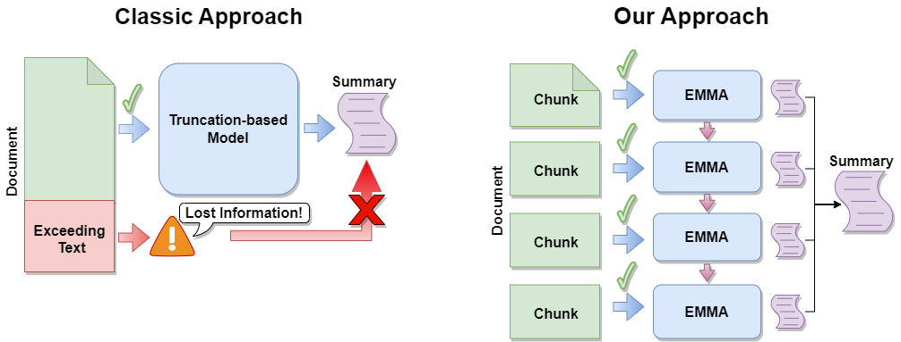
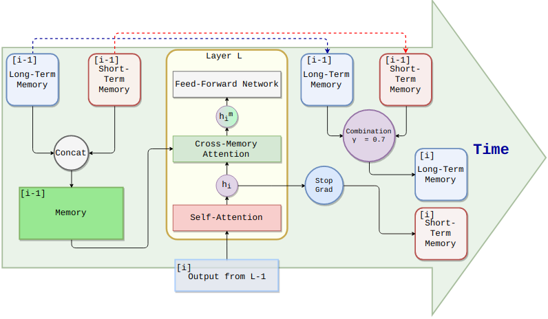

# Emma

An efficient memory-enhanced encoder-decoder language model for long document summarization: combining text segmentation and cross-memory attention.

  

  

## Supplementary Material

Check [human evaluation results](human_eval/).

## License

This project is released under the CC-BY-SA 3.0 IT license (see `LICENSE`).
